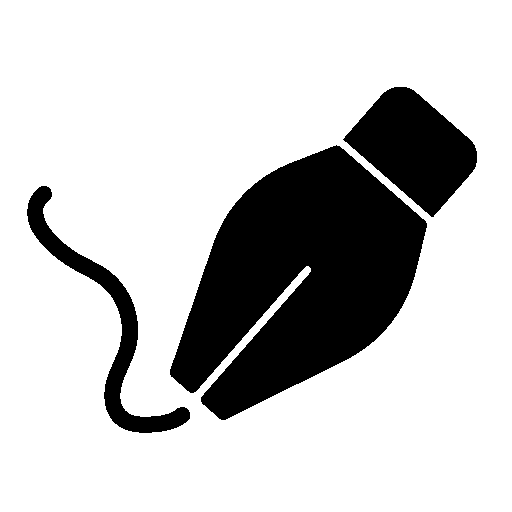

Отличная программа! Вот готовый файл `README.md` для твоего проекта MotionQuill:

```markdown
# MotionQuill 🎨

**Pixel Animation Studio** — программа для создания покадровой пиксельной анимации с удобным интерфейсом и набором инструментов для рисования.



## ✨ Возможности

### 🎨 Рисование
- **Инструменты**: карандаш, ластик, заливка, пипетка
- **Фигуры**: линии, прямоугольники, круги
- **Настройка толщины** линий и заливки фигур
- **Регулируемый размер** пикселя/кисти (1-50px)
- **Палитра цветов** с предпросмотром и выбором
- **Сетка** для точного рисования

### 🎬 Анимация
- **Покадровое создание** анимации
- **Управление кадрами**: добавление, удаление, копирование, вставка
- **Просмотр предыдущего кадра** с настраиваемой прозрачностью
- **Воспроизведение** с регулировкой FPS (8-60)
- **Визуальный таймлайн** с навигацией
- **Миниатюры кадров** для быстрого доступа

### 📁 Файловые операции
- **Сохранение/загрузка** проектов
- **Импорт изображений** (PNG, JPG, GIF, BMP)
- **Экспорт в GIF** анимацию
- **Экспорт PNG последовательности** кадров

### 🎮 Интерфейс
- **Темная тема** с акцентным цветом
- **Интуитивное управление** и горячие клавиши
- **История действий** (отмена/повтор до 50 шагов)
- **Статус бар** с информацией о координатах и состоянии
- **Панель инструментов** с иконками

## 🚀 Установка

### Требования
- Python 3.7 или выше
- Установленные зависимости:
  ```bash
  pip install pillow
  ```

### Запуск
1. Скачай файл `stop_motion.py`
2. Создай папку `resources` со структурой:
   ```
   resources/
   ├── icon/
   │   └── icon.png          # Иконка программы
   └── tools/
       ├── pencil.png         # Иконка карандаша
       ├── eraser.png         # Иконка ластика
       ├── filling.png        # Иконка заливки
       └── pipette.png        # Иконка пипетки
   ```
3. Запусти программу:
   ```bash
   python stop_motion.py
   ```

## ⌨️ Горячие клавиши

### Файл
| Клавиши | Действие |
|---------|----------|
| `Ctrl+N` | Новый проект |
| `Ctrl+O` | Открыть проект |
| `Ctrl+S` | Сохранить |
| `Ctrl+Shift+S` | Сохранить как |
| `Ctrl+I` | Импорт изображения |

### Правка
| Клавиши | Действие |
|---------|----------|
| `Ctrl+Z` | Отменить |
| `Ctrl+Y` | Повторить |
| `Ctrl+C` | Копировать кадр |
| `Ctrl+V` | Вставить кадр |
| `Delete` | Удалить кадр |

### Вид
| Клавиши | Действие |
|---------|----------|
| `Ctrl+G` | Показать/скрыть сетку |
| `Ctrl+P` | Показать предыдущий кадр |

### Навигация
| Клавиши | Действие |
|---------|----------|
| `←` `→` | Предыдущий/следующий кадр |
| `Пробел` | Воспроизведение/Пауза |

## 🎯 Использование

### Создание анимации
1. **Новый проект**: `Файл → Новый проект` или `Ctrl+N`
2. **Рисование**: выбери инструмент, цвет и размер кисти
3. **Добавление кадров**: кнопка `➕ Добавить` на панели кадров
4. **Просмотр анимации**: нажми `▶` или пробел

### Инструменты
- **Карандаш** ✏️ — рисование пикселями
- **Ластик** 🧽 — стирание
- **Заливка** 🪣 — заливка области
- **Пипетка** 👁 — выбор цвета с холста
- **Фигуры** — линии, прямоугольники, круги с заливкой

### Советы
- Используй сетку (`Ctrl+G`) для точного рисования
- Включи просмотр предыдущего кадра (`Ctrl+P`) для создания плавной анимации
- Настраивай FPS для разной скорости анимации
- Сохраняй проект в папку для последующего редактирования

## 📦 Формат проекта

Проект сохраняется как папка с:
- `frame_0000.png`, `frame_0001.png`, ... — кадры анимации
- `project.json` — метаданные (FPS, количество кадров, дата)

## 🤝 Лицензия

MIT License. См. файл `LICENSE` для подробностей.

## 👨‍💻 Автор

STUDIO N (2026)

---

**MotionQuill** — создавай пиксельные шедевры кадр за кадром! ✨

## Структура папок для полного проекта:

```
MotionQuill/
├── stop_motion.py          # Главный файл программы
├── LICENSE                  # MIT лицензия
├── README.md               # Документация
└── resources/
    ├── icon/
    │   └── icon.png        # Иконка программы
    └── tools/
        ├── pencil.png      # Иконка карандаша
        ├── eraser.png      # Иконка ластика
        ├── filling.png     # Иконка заливки
        └── pipette.png     # Иконка пипетки
```
